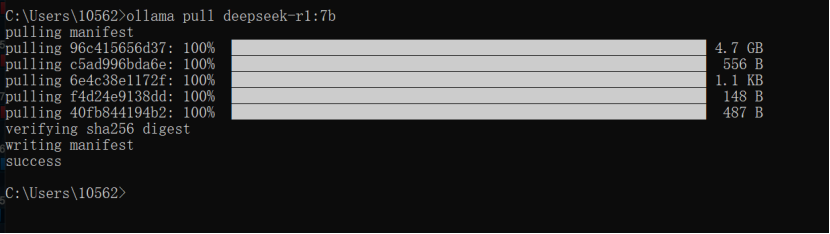
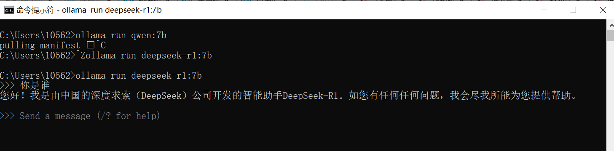
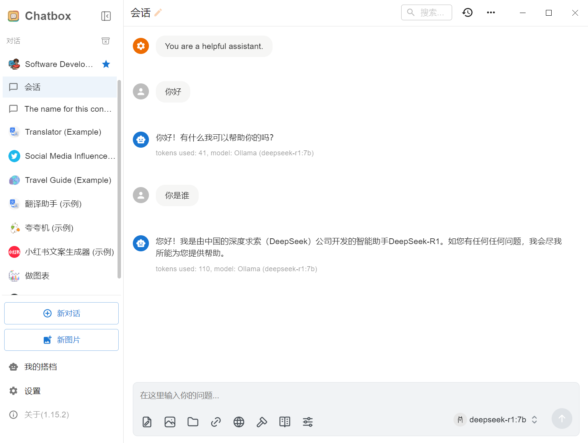
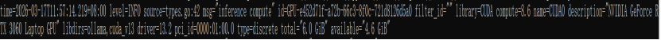
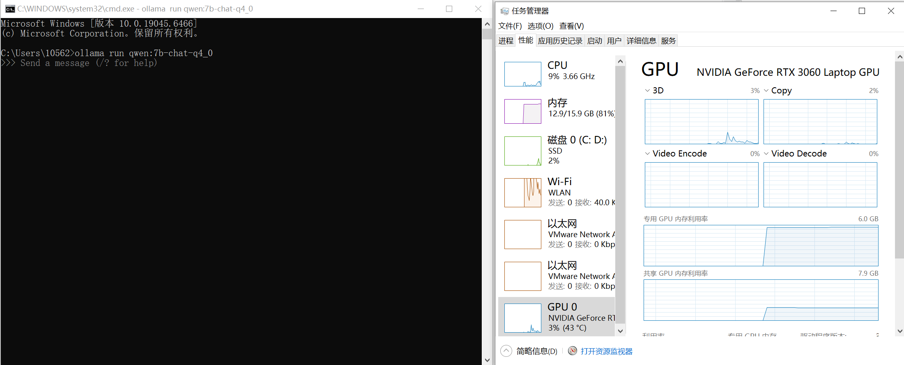
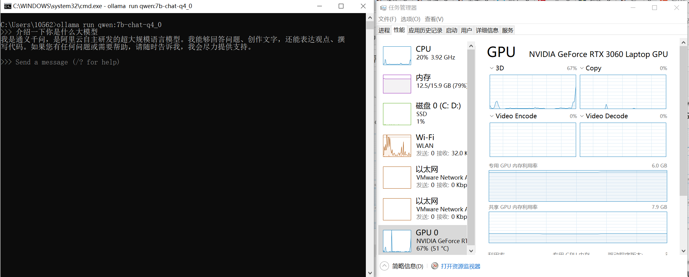

# 入门实战｜RTX3060本地私有化部署DeepSeek 7B聊天机器人（离线可用+GPU加速调优）
# 前言

本文为大模型部署实战系列第一篇，基于 Windows 环境与 RTX3060 显卡，借助 Ollama 快速实现 DeepSeek-7B 开源大模型本地私有化部署，搭配 Chatbox 完成可视化交互界面搭建，并针对 GPU 进行推理加速调优，最终实现可离线运行的本地聊天机器人。

# 一、项目核心技术栈与适用场景

本项目为大模型应用开发入门级实战，全程采用开源轻量化工具链，无需高额算力成本，环境适配 Windows 系统（RTX3060 显卡），所有步骤均可复现。通过本实战可掌握大模型本地私有化部署的核心流程，为后续 Agent、RAG 等进阶应用打下基础，核心技术栈与适用场景如下：

## 1.1 核心技术栈

- **私有化部署核心工具**：Ollama（跨平台开源大模型本地运行工具，支持 Windows/macOS/Linux，可一键拉取、运行各类开源大模型，无需手动编译、配置依赖，轻量化易上手）；Chatbox（开源跨平台 AI 桌面客户端，支持无缝连接 Ollama 本地模型，提供可视化聊天界面，支持多模型切换、本地对话数据存储，降低交互门槛）


- **开发与交互工具**：Python 3.9+、Ollama Python SDK（用于代码层面调用本地模型，实现自动化交互 / 扩展）

- **核心模型**：DeepSeek-7B、qwen:7b-chat-q4_0（轻量级开源大模型，适配消费级显卡 RTX3060，离线运行性能均衡）

## 1.2 项目核心目标

1. 掌握 Ollama 的安装、配置流程，以及开源大模型（DeepSeek-7B）的拉取、本地启动与基础验证方法，实现大模型纯离线私有化部署；

2. 完成 Chatbox 客户端与 Ollama 本地模型的对接，实现可视化、交互式的本地模型聊天功能；

3. 了解消费级 GPU（RTX3060）的参数调优思路，提升本地模型推理速度。

# 二、大模型本地私有化部署（Ollama+Chatbox）

大模型私有化部署的核心优势是**数据本地存储、无外网依赖、零API调用成本**，适合入门阶段熟悉大模型运行逻辑，也可用于日常本地AI交互。本环节依托Ollama简化部署流程，搭配Chatbox实现友好的可视化交互，全程无需编译源码，新手可快速完成。

## 2.1 前置环境准备

系统：  
    Windows 10/11 64 位（推荐 11，对 GPU 驱动兼容性更好）

硬件：

    CPU：任意多核 CPU（建议 i5 及以上），开启 BIOS 中的 CPU 硬件虚拟化（提升模型加载速度）

    内存：8GB 及以上（16GB 最佳，避免模型运行时内存溢出）

    磁盘：预留 10GB 以上空闲空间（存储模型文件与工具依赖）
    GPU：RTX3060（笔记本 / 台式机均可），提前安装 NVIDIA 驱动（版本≥530，保障 CUDA 调用）

## 2.2 Ollama安装与本地模型运行

Ollama 是当前主流的开源大模型本地运行工具，支持一键拉取 Llama 3、DeepSeek、Qwen、Mistral 等主流开源模型，无需手动配置环境变量与依赖，操作极度轻量化，是入门级私有化部署的首选工具。

### 2.2.1 Ollama安装步骤

1. 访问Ollama官方网站（[https://ollama.com/](https://ollama.com/)），下载对应Windows版本安装包（exe 格式）；

2. 双击安装包，全程默认 “下一步” 完成安装（安装路径建议默认，避免权限问题），安装过程会自动配置系统环境变量，无需手动操作；

3. 安装完成后，打开 CMD 或 PowerShell（管理员模式更佳），输入校验命令：

```bash
ollama --version
```

正常返回版本号（如ollama version 0.1.100）即代表安装成功，Ollama服务会默认后台运行，也可手动启动服务。

### 2.2.2 开源模型拉取与启动

入门阶段我们先选用 deepseek-r1:7b 完成部署流程的跑通验证。该模型虽可在 RTX3060 上正常启动，但原生模型资源占用较高，默认仅使用 CPU 推理，响应速度较慢。因此后文将通过 GPU 加速配置 + 更换低量化模型 两步优化，大幅提升本地推理速度。操作步骤如下：

1. 手动启动Ollama后台服务（确保服务正常运行）：

```bash
ollama serve
# 注意：服务启动后请勿关闭当前终端窗口，关闭即终止服务，后续模型无法调用；
```

2. 新建CMD或PowerShell窗口，执行模型拉取命令(模型拉取速度取决于网络环境，耐心等待下载完成，无需额外解压配置)：

```bash
ollama pull deepseek-r1:7b
```



踩坑点：若执行拉取命令后进度卡住，按 Ctrl+C 才跳进度（本质是海外镜像源网络不稳定、断连重连导致）。

解决方案：配置国内镜像源，步骤如下：
1.彻底终止 Ollama 进程：按Ctrl+Shift+Esc打开任务管理器，找到ollama.exe进程，右键「结束任务」；

2.配置国内镜像环境变量（二选一，阿里云 / AIOS 均稳定）：
```bash
# 方式1：阿里云镜像（推荐）
set OLLAMA_MODEL_SERVER=https://mirrors.aliyun.com/ollama
# 方式2：AIOS镜像
set OLLAMA_MIRROR=https://mirror.aioscdn.com/ollama/
```
注意：配置后必须重启终端（环境变量生效），再重新执行拉取命令。

3. 终端直接测试模型运行：

```bash
ollama run deepseek-r1:7b
```

进入交互界面后，输入测试问题，模型正常返回响应，即代表本地模型部署成功。



## 2.3 Chatbox安装与Ollama对接

Chatbox是开源跨平台AI桌面客户端（社区版遵循GPLv3开源协议），支持Windows、macOS、Linux多系统，主打本地数据存储、无复杂部署，可无缝对接Ollama本地模型，替代终端实现更直观的可视化聊天。

### 2.3.1 Chatbox安装

1. 访问Chatbox官方GitHub仓库（[https://github.com/chatboxai/chatbox](https://github.com/chatboxai/chatbox)），下载Windows桌面版安装包（或直接访问Chatbox 官网下载，更便捷）；

2. 双击安装包完成安装，启动客户端，无需注册登录，直接进入主界面。

### 2.3.2 连接本地Ollama模型

1. 确保Ollama后台服务处于运行状态（`ollama serve`命令未终止）；

2. 打开Chatbox，点击左上角**设置**选项，进入模型配置页面；

3. 模型类型选择**Ollama**，默认连接地址为`http://localhost:11434`（Ollama默认端口，无需修改）；

4. 点击连接测试，连接成功后，选择已拉取的`deepseek-r1:7b`模型，保存配置；

5. 返回主界面，即可在Chatbox中与本地私有化大模型正常聊天（离线可用），所有对话数据本地存储，保障隐私安全。


# 三、RTX3060 GPU 加速与推理性能调优

默认情况下 Ollama 优先使用 CPU 运行模型，推理速度极慢（10 + 秒 / 句），针对 RTX3060（显存 6GB）的硬件特性，通过以下步骤实现 GPU 加速，将推理速度提升至 2~5 秒 / 句：

## 3.1 版本前置要求

旧版 Ollama（版本 < 0.1.90）对 NVIDIA 显卡适配性极差，无官方 GPU 配置入口，需先升级至新版：
卸载旧版 Ollama，重新下载安装0.1.90 + 版本（如0.18.0版本）；

新版 Ollama 安装后，拉取轻量化模型qwen:7b-chat-q4_0，执行ollama run qwen:7b-chat-q4_0即可终端对话，同时后台自动启动 API 服务（127.0.0.1:11434），供 Chatbox 调用。

## 3.2 强制启用 GPU 加速

1.  先终止所有 Ollama 进程（任务管理器结束ollama.exe）；

2.  打开 CMD（管理员模式），执行以下命令配置 GPU 参数（RTX3060 适配）：


```bash
# 强制启用GPU（1代表优先使用GPU，0为仅CPU）
set OLLAMA_NUM_GPU=1
# GPU分层数（RTX3060设200足够，最大化利用显存）
set OLLAMA_GPU_LAYERS=200
# 启用CUDA加速（NVIDIA显卡核心）
set OLLAMA_CUDA=1

# 前台启动Ollama，查看GPU识别日志（关键验证）
ollama serve
```

 验证成功：日志中出现如下图信息即代表 GPU 识别成功。
 


## 3.3 量化模型选择与下载

```bash
# 1. 配置阿里云镜像（下载速度提升10倍）
set OLLAMA_MODEL_SERVER=https://mirrors.aliyun.com/ollama

# 2. 拉取qwen:7b-chat-q4_0量化版（仅占用4GB显存，完美适配3060）
ollama pull qwen:7b-chat-q4_0

# 3. 启动量化版模型（GPU加速模式）
ollama run qwen:7b-chat-q4_0
```
 效果对比如图所示（GPU使用率明显提升）：






# 四、项目总结与后续扩展规划

## 4.1 项目实战收获与复盘

本文完成了从 0 到 1 的开源大模型本地私有化部署实战，主要工作内容如下：
1. 基于 Ollama 完成 DeepSeek-7B 模型在 Windows 环境的拉取、运行与验证；
2. 对接 Chatbox 实现可视化离线聊天界面，实现数据本地存储；
3. 针对 RTX3060 完成 GPU 加速配置，解决模型默认仅使用 CPU 推理的问题；
4. 通过更换 4bit 量化模型与配置国内镜像，解决下载慢、显存不足、推理延迟高等实际问题。

## 4.2 后续扩展方向
基于本次本地部署的基础，后续将从工程化与应用能力方向进行延伸：
1. 前端升级：使用 Streamlit 替代 Chatbox，构建可自定义的 Web 聊天界面，实现浏览器访问与在线交互；
2. 后端升级：引入 LangChain 替代原生 Ollama 调用，构建标准化的大模型应用链路，为后续接入 RAG、多轮对话、工具调用提供框架支撑；
3. 能力扩展：逐步集成文档知识库、检索增强、Agent 任务调度等能力，形成完整的大模型应用项目。

